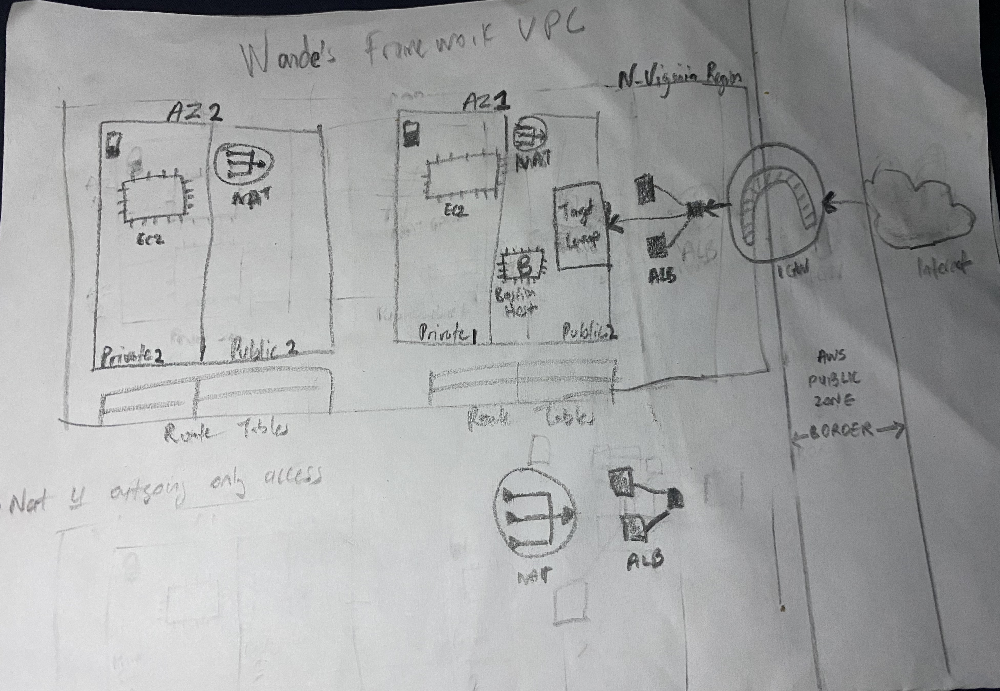

## Architecture Diagram:

## Description:
Creating and configuring an elastic, highly available single tier AWS Architecture

## Access links:
* domain name: [wandexdev.me](https://wandexdev.me)
* ALB's domain:[ALB's domain dns](wandealtschool-ALB-427409128.us-east-1.elb.amazonaws.com)

## Architecture Essentials (Network and Servers):
* 1 Virtual Private Cloud[VPC] (Regional so one needed)
* Internet gateway[IG] (grant internet access to the vpc)
* Subnets
	* 4 Subnets (2 pubic, 2 Private in 2 availability zones)
* Launch Configuration[LC]
	* Include userdata bash script.
* Autoscaling group[ASG]
	* Select LC aleady created
* Target group for the instances
* Application Load Balancer[ALB] (cordinates the traffic to the ASG)
	* Associate already created Target group
	* Configure listeners
* Instances with no assigned Public Ipv4, just normal Private ones.
* Network Address Translator[NAT] Gateway or Instance (Provides 1 public IPv4 for all Private instances in order to allow internet requests flow to them)
	* allocate the public elastic ip
* Route Tables
	* create, adjust routes and associate with the subnets
* Security Groups[SG]
	* instances SG should allow inbound traffic from HTTP from ALB
	* ALB SG should allow inbound traffic from HTTP frpm anywhere (0.0.0.0/0)

## DNS Records and SSL Certificates
* Route 53[R53] 
	* Name servers
	* Hosted zone
	* Certificate Manager
* Primary Domain Provider's DNS

---
PICTURE PROOF OF AWS INFRASTRUCTURE AS MENTIONED BY TUTOR KUNRAD FROM LIVE CLASS
* Personal VPC:

*  Subnets:

* Private Instances:

* Launch Template:

* AutoScaling Group:

* Application Load Balancer:

* Target Group:

* Route 53 mangaging my custom domain name linked with ALB's DNS:

