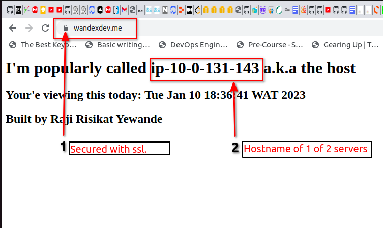

# BASH SCRIPT AS EC2 USER DATA:
These are bash scripts that automatically installs, updates and configures OS asprewritten in the script. 
* It can be used as user data when lauching instances or when creating lauch templates with absolutely no need to use the terminal a.k.a bootstap
* They can also be run manually as a script on the terminal
---
## Option A:[link](https://github.com/wandexdev/singletier-aws-architecture/blob/main/bash-bootstrap/ec2_userdatascript.sh)
This script outputs both pages served via NGINX from both private ec2 instances passed through the application load balancer.

* NO Manual terminal configuration done
* No ssh via external host/bastion host needed. 
* Instances were configured to full servers as soon as they were launched
* Auto Scaling Group automatically created the amount of servers needed via launch templates.
---
## Option B:[link](https://github.com/wandexdev/singletier-aws-architecture/blob/main/bash-bootstrap/flask_userdata.sh)
This bash script intalls, builds and deploys a Python_Flask app with all dependies(python3, venv, pip, uwsgi etc) needed to run efficiently.

* It also installs and configures NGINX to serve the app.
* The simple python_Flask app diplays hosname and ip address of the server its listening to.
### Limitation:
I couldnt use this script to automatically create instnaces in my private subnets. It worked perfectly for public instances because of their public IPv4 addresses which the private ones do not have.
......Ill definetely do more research.

## Option C:[linl](https://github.com/wandexdev/singletier-aws-architecture/blob/main/bash-bootstrap/htmluserdata.sh)
This bash script installs, configures instances and sets nginx to display hostname in an inlined styled html file. 

### Limitation:
It refused to show the hostname as it kept returning the `$(Hostname -f) as a normal string. Im assuming the html formatting made it this way. 
....... I'll definately do more research.
